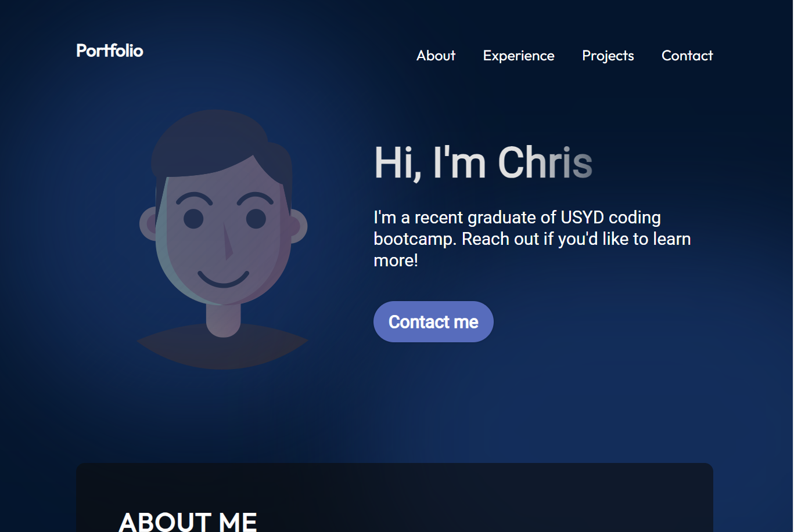

# react-portfolio

## Description
This is the first draft of my React portfolio website.  This was my first time using React and I am looking forward to learning a lot more about its functionality.  
I have created this portfolio to showcase some of my coding bootcamp projects and give myself a staging area to post future projects I will complete to show potential employers in the future. 

## Installing
N/A

## Usage
All the user needs to do is click on the deployed webpage below in order to explore my portfolio 

## Deployment
This React portfolio is deployed using Netlify 

## Screenshot

## Authors
Chris Reynolds 

## License
Please refer to the license in repo

